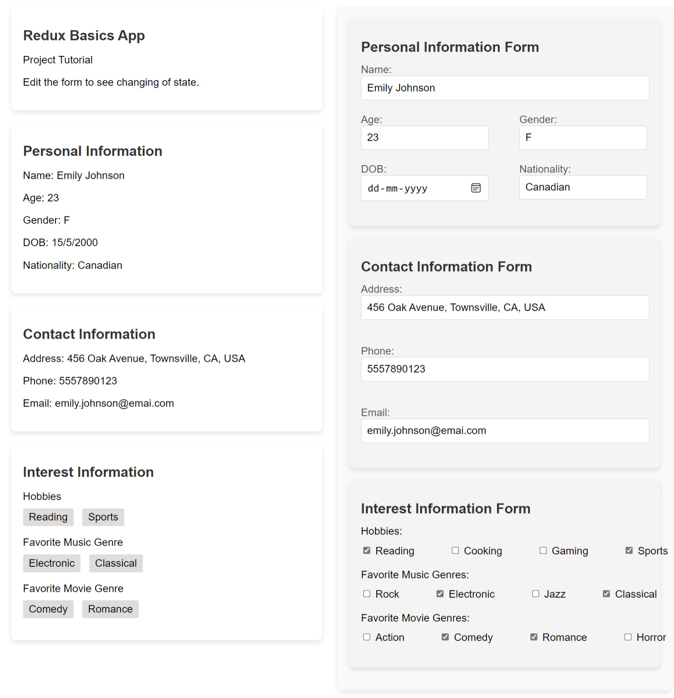

# Redux Toolkit Basics

Welcome to the Redux Toolkit Basics project! This project is a demonstration of using Redux Toolkit for state management in a React application.

## Project Structure

-   **App.js**: The main component that sets up the application structure and includes various information components.
-   **components/**
    -   **StateComponent.js**: Component displaying project information and state.
    -   **PersonalInfo.js**: Form and display of personal information.
    -   **ContactInfo.js**: Form and display of contact information.
    -   **InterestInfo.js**: Form and display of interest information.
-   **features/**
    -   **personalSlice.js**: Redux slice for managing personal information.
    -   **contactSlice.js**: Redux slice for managing contact information.
    -   **interestSlice.js**: Redux slice for managing interest information.
    -   **rootReducer.js**: Combines all the reducers into a root reducer.
-   **app/**
    -   **store.js**: Configures the Redux store.

## Getting Started

1. Clone the repository:

    ```bash
    git clone https://github.com/harshm413/redux-toolkit-basics.git
    ```

2. Navigate to the project directory:

    ```bash
    cd redux-toolkit-basics
    ```

3. Install dependencies:

    ```bash
    npm install
    ```

4. Run the project:

    ```bash
    npm start
    ```

5. Open your browser and visit [http://localhost:3000](http://localhost:3000) to see the Redux Toolkit Basics app in action.

## Features

-   **Personal Information Form**: Edit and view personal information with real-time state updates.
-   **Contact Information Form**: Edit and view contact information with real-time state updates.
-   **Interest Information Form**: Edit and view interest information with real-time state updates.

## Technologies Used

-   React
-   Redux Toolkit

## Project Preview



## Contributing

Feel free to contribute to the project by submitting issues or pull requests. Your feedback is highly appreciated!

## License

This project is open-source and available under the [MIT License](LICENSE).

Happy coding with Redux Toolkit! 🚀🔧
